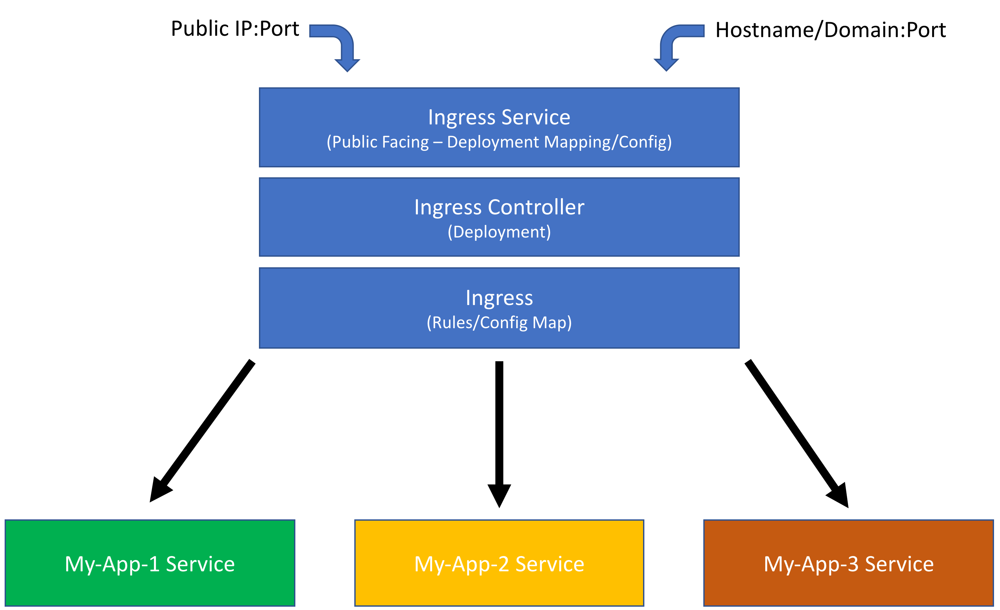

# Kubernetes Ingress Controllers Explained

Kubernetes ingress controllers are an amazing service on K8s that allows you to route public requests to the proper internal K8s services you have running.

## Prerequisites
- Understanding of:
    - Services and Service Manifest File in K8s
    - Deployments and Deployment Manifest File in K8s

## Anatomy of an Ingress Controller

Essentailly you can think of an Ingress Controller/Service as needing 3 things:
1. A [Service manifest](01_ingress-service-example.yaml) defined that will point to the pods/deployment that handles the actual proxying of requests
    - This is nothing different that a service definition for any other app
    - The type will be ```loadBalancer``` and it will provision an IP address for you
2. A [Deployment manifest](02_ingress-controller-deployment-example.yaml) that handles standing up the pods/replicas that represent the actual Ingress Controller mechanism
    - 3 Popular choices are [GCE Ingress](https://github.com/kubernetes/ingress-gce), [Nginx](https://github.com/kubernetes/ingress-nginx) (both maintained by Kubernetes Team) and [Traefik](https://traefik.io/)
    - You can run multiple types of Ingress Controllers (GCE, Nginx, Traefik...others)
        - You target this with a special ```annotation``` which you can see [here](https://github.com/raykao/kubernetes_ingress_controllers_explained/blob/6d552db614cba32179a058caf5541585367685c9/03_ingress-rule-example.yaml#L5)
3. At least one [Rules/Config Map Manifest](03_ingress-rule-example.yaml) that define how the controller(s) should proxy/route requests to the actual underlying services you wish send payloads to
    - These are ingress rules/config maps that define:
        - On a certain Public IP/Hostname/Domain and/or Port combination, to which named k8s service should you route to e.g. [```My-App-1 Service```, ```My-App-2 Service```, ```My-App-3 Service```]

You can deploy with one large Manifest file or break down the deployment.

